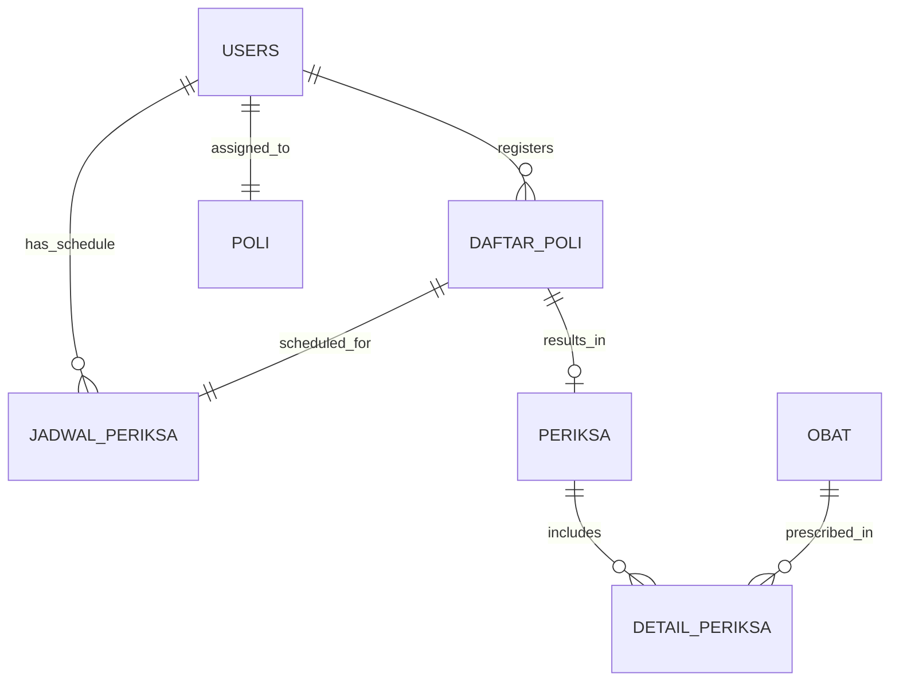

# Poliklinik Bengkel Koding

A comprehensive clinic management system built with Laravel 11, designed to streamline healthcare operations and patient management with modern web technologies.

## Project Overview

**Poliklinik Bengkel Koding** is a full-featured web-based clinic management system that digitizes and automates healthcare facility operations. Built with Laravel 11 and modern frontend technologies, it provides a complete solution for managing patients, doctors, medical appointments, examinations, prescriptions, and multi-clinic administration.

### Core Features

#### Multi-Role User Management
- **Admin Panel**: Complete system administration with user management
- **Doctor Dashboard**: Medical professional interface with patient management
- **Patient Portal**: Self-service registration and appointment booking
- **Role-Based Access Control**: Secure permission system (Status: 1=Admin, 2=Doctor, 3=Patient)

#### Patient Management System
- **Digital Patient Records**: Complete patient registration with auto-generated medical record numbers
- **Patient Information**: Contact details, address, national ID (KTP), and phone numbers
- **Medical History**: Comprehensive examination and treatment history tracking
- **Doctor-Patient Relationships**: Filtered patient views based on doctor assignments

#### Doctor & Staff Management
- **Doctor Profiles**: Professional information with clinic specialization assignments
- **Schedule Management**: Flexible scheduling system with day-wise availability
- **Patient Queue**: Real-time patient queue management for each doctor
- **Clinic Assignments**: Multi-clinic support with specialized departments

#### Advanced Appointment System
- **Smart Scheduling**: Queue-based appointment system preventing conflicts
- **Auto Queue Numbers**: Automatic queue number generation for fair patient handling
- **Schedule Integration**: Appointments linked to doctor availability schedules
- **Complaint Tracking**: Initial patient complaints recorded during registration

#### Medical Examination Records
- **Digital Examinations**: Comprehensive examination forms with diagnosis tracking
- **Treatment Notes**: Detailed medical notes and observations
- **Cost Calculation**: Automated billing and examination fee calculation
- **Date/Time Tracking**: Precise examination timing and scheduling

#### Medication & Prescription Management
- **Drug Database**: Complete medication inventory with pricing and packaging info
- **Prescription System**: Digital prescription creation linked to examinations
- **Multi-Drug Prescriptions**: Support for multiple medications per examination
- **Cost Integration**: Automatic medication cost calculation

### Business Impact

- ✅ **Digital Transformation** - Complete elimination of paper-based records
- ✅ **Operational Efficiency** - Automated workflows and queue management
- ✅ **Patient Care Quality** - Quick access to comprehensive medical histories
- ✅ **Resource Optimization** - Efficient doctor schedule and resource allocation
- ✅ **Data Security** - Secure, encrypted patient data with role-based access
- ✅ **Scalability** - Multi-clinic support for healthcare facility expansion

## Technical Architecture

### Backend Framework
```
Laravel 11 Framework
├── PHP 8.2+ (Latest performance optimizations)
├── Eloquent ORM (Advanced relationship management)
├── Artisan CLI (Custom commands and automation)
├── Laravel Sanctum (API authentication)
├── Laravel Jetstream (Application scaffolding)
└── Laravel Fortify (Authentication backend)
```

### Frontend & User Interface
```
Modern Frontend Stack
├── Laravel Livewire 3 (Reactive components without JS complexity)
├── Tailwind CSS 3.4+ (Utility-first styling framework)
├── Material Tailwind (Enhanced UI components)
├── Flowbite Components (Interactive elements and modals)
├── Flatpickr (Advanced date/time selection)
└── Vite (Fast build tool with HMR)
```

### Database & Storage
- **SQLite** (Development) / **MySQL/PostgreSQL** (Production ready)
- **Eloquent ORM** with advanced relationships and query optimization
- **Database migrations** for version-controlled schema management
- **Comprehensive seeders** for sample data and testing environments

### Security Implementation
- **Multi-layer Authentication**: Jetstream + Fortify + Sanctum integration
- **Role-Based Access Control**: Custom middleware for user roles (Admin/Doctor/Patient)
- **Session Management**: Secure session handling with user status validation
- **CSRF Protection**: Cross-site request forgery prevention
- **Input Validation**: Comprehensive server-side validation
- **Password Security**: Bcrypt hashing with secure defaults

## Database Architecture

The system is built around 8 core entities with sophisticated relationships and data integrity:

### Entity Relationship Overview



### Core Database Schema

#### Users Table (Multi-role: Admin/Doctor/Patient)
```sql
users
├── id (Primary Key)
├── name (Full Name)
├── email (Email Address)
├── password (Encrypted Password)
├── alamat (Address)
├── no_ktp (National ID Number)
├── no_hp (Phone Number)
├── no_rm (Medical Record Number - Auto-generated)
├── id_poli (Foreign Key → Poli - For Doctors)
├── status (Role: 1=Admin, 2=Doctor, 3=Patient)
├── email_verified_at
└── timestamps
```

#### Medical Clinics (Poli)
```sql
poli
├── id (Primary Key)
├── nama_poli (Clinic Name)
├── keterangan (Description/Services)
└── timestamps
```

#### Appointment Registrations (Daftar Poli)
```sql
daftar_poli
├── id (Primary Key)
├── id_pasien (Foreign Key → Users)
├── id_jadwal (Foreign Key → Jadwal Periksa)
├── keluhan (Chief Complaint/Symptoms)
├── no_antrian (Queue Number - Auto-generated)
└── timestamps
```

#### Doctor Schedules (Jadwal Periksa)
```sql
jadwal_periksa
├── id (Primary Key)
├── id_dokter (Foreign Key → Users)
├── hari (Day: senin, selasa, rabu, kamis, jumat, sabtu, minggu)
├── jam_mulai (Start Time)
├── jam_selesai (End Time)
└── timestamps
```

#### Medical Examinations (Periksa)
```sql
periksa
├── id (Primary Key)
├── id_daftar_poli (Foreign Key → Daftar Poli)
├── tgl_periksa (Examination Date)
├── catatan (Medical Notes/Diagnosis)
├── biaya_periksa (Examination Fee)
└── timestamps
```

#### Medications (Obat)
```sql
obat
├── id (Primary Key)
├── nama_obat (Medication Name)
├── kemasan (Packaging Type)
├── harga (Price per Unit)
└── timestamps
```

#### Prescription Details (Detail Periksa)
```sql
detail_periksa
├── id (Primary Key)
├── id_periksa (Foreign Key → Periksa)
├── id_obat (Foreign Key → Obat)
└── timestamps
```

### Advanced Database Features

- **Role-based Data Access**: Dynamic data filtering based on user roles
- **Auto-incrementing Systems**: Queue numbers and medical record generation
- **Referential Integrity**: Foreign key constraints ensure data consistency
- **Soft Deletes**: Maintains historical data for auditing
- **Index Optimization**: Strategic indexing for high-performance queries

### Data Flow Architecture

```
Patient Registration → Schedule Selection → Queue Assignment → 
Doctor Examination → Prescription Creation → Cost Calculation → 
Medical History Update
```

## Advanced Routing & Middleware

### Route Structure
```php
// Public Routes
Route::get('/', 'WelcomeController@index')->name('home');

// Authenticated Routes (Sanctum + Jetstream)
Route::middleware(['auth:sanctum', 'verified'])->group(function () {
    
    // Admin Routes (Status: 1)
    Route::middleware(['roleAccess:1'])->group(function() {
        Route::resource('dokter', DokterController::class);
        Route::resource('pasien', PasienController::class);
        Route::resource('poli', PoliController::class);
        Route::resource('obat', ObatController::class);
    });
    
    // Doctor Routes (Status: 2)
    Route::middleware(['roleAccess:2'])->group(function() {
        Route::resource('jadwal', JadwalPeriksaController::class);
        Route::resource('periksa', PeriksaController::class);
        Route::get('pasien-by-doctor', 'PasienController@indexByDoctor');
    });
    
    // Patient Routes (Status: 3)
    Route::middleware(['roleAccess:3'])->group(function() {
        Route::resource('daftar-poli', DaftarPoliController::class);
        Route::get('riwayat', 'PeriksaController@riwayatPeriksa');
    });
});
```

### Custom Middleware Implementation

#### Role Access Control
```php
class RoleAccess
{
    public function handle(Request $request, Closure $next, ...$roles)
    {
        $userStatus = session()->get('status');
        
        if (!$userStatus || $userStatus == 0) {
            return redirect('/')->with('error', 'Unauthorized access');
        }
        
        if (in_array($userStatus, $roles)) {
            return $next($request);
        }
        
        abort(404);
    }
}
```

## Key Controller Features

### Smart Data Relationships
```php
// Doctor-Patient Relationship via Schedules
public function indexByDoctor()
{
    $doctorId = session()->get('id');
    
    $patients = User::whereIn('id', function ($query) use ($doctorId) {
        $query->select('id_pasien')
              ->from('daftar_poli')
              ->whereIn('id_jadwal', function ($subQuery) use ($doctorId) {
                  $subQuery->select('id')
                           ->from('jadwal_periksa')
                           ->where('id_dokter', $doctorId);
              });
    })->get();
}
```

### Automated Queue Management
```php
// Auto-generate queue numbers per schedule
public function store(Request $request)
{
    $maxQueue = DaftarPoli::where('id_jadwal', $request->id_jadwal)
                          ->max('no_antrian');
    
    DaftarPoli::create([
        'id_pasien' => $request->id_pasien,
        'id_jadwal' => $request->id_jadwal,
        'keluhan' => $request->keluhan,
        'no_antrian' => $maxQueue + 1
    ]);
}
```

## Installation & Development Setup

### System Requirements
```bash
PHP >= 8.2
Composer >= 2.0
Node.js >= 18.0
NPM >= 9.0
SQLite/MySQL/PostgreSQL
```

### Quick Installation
```bash
# Clone repository
git clone https://github.com/JavierFadel/poliklinik-bengkel-koding.git
cd poliklinik-bengkel-koding

# Install PHP dependencies
composer install

# Install Node.js dependencies  
npm install

# Environment setup
cp .env.example .env
php artisan key:generate

# Database setup
touch database/database.sqlite
php artisan migrate
php artisan db:seed

# Build frontend assets
npm run dev

# Start development server
php artisan serve
```

### Production Deployment
```bash
# Production optimizations
composer install --optimize-autoloader --no-dev
npm run build
php artisan config:cache
php artisan route:cache
php artisan view:cache
```

## Project Architecture

### MVC Architecture Overview
```
app/
├── Http/
│   ├── Controllers/          # Business logic handlers
│   │   ├── DokterController.php
│   │   ├── PasienController.php
│   │   ├── PeriksaController.php
│   │   └── ... (8 core controllers)
│   └── Middleware/           # Request filtering
│       ├── RoleAccess.php
│       ├── AdminMiddleware.php
│       └── CheckUserStatus.php
├── Models/                   # Eloquent ORM models
│   ├── User.php             # Multi-role user model
│   ├── Poli.php
│   ├── DaftarPoli.php
│   └── ... (8 core models)
└── View/Components/          # Reusable UI components

resources/
├── views/
│   ├── pages/               # Feature-specific views
│   │   ├── dokter/          # Doctor management
│   │   ├── pasien/          # Patient management
│   │   ├── periksa/         # Examination system
│   │   └── ... (8 modules)
│   ├── layouts/             # Master layouts
│   └── components/          # Reusable components
├── css/app.css              # Tailwind CSS entry
└── js/app.js                # JavaScript entry

database/
├── migrations/              # Database schema versions
└── seeders/                 # Sample data generators
```

## Feature Modules

### 1. User Management System
- **Multi-role Authentication**: Admin, Doctor, Patient roles
- **Profile Management**: Jetstream-powered user profiles
- **Security Features**: Two-factor authentication, session management

### 2. Doctor Management
- **Professional Profiles**: Complete doctor information
- **Clinic Assignments**: Specialization-based assignments
- **Schedule Management**: Flexible time slot management

### 3. Patient Registration System
- **Digital Records**: Comprehensive patient information
- **Medical Record Numbers**: Auto-generated unique identifiers
- **Contact Management**: Emergency contacts and communication

### 4. Appointment System
- **Smart Scheduling**: Conflict-free appointment booking
- **Queue Management**: Fair queue number assignment
- **Status Tracking**: Real-time appointment status updates

### 5. Examination Module
- **Digital Forms**: Comprehensive examination records
- **Diagnosis Tracking**: Medical notes and observations
- **Cost Calculation**: Automated billing integration

### 6. Prescription Management
- **Drug Database**: Complete medication inventory
- **Prescription Creation**: Link examinations to medications
- **Cost Integration**: Automatic pricing calculations

### 7. Medical History
- **Treatment Tracking**: Complete patient treatment history
- **Doctor Access**: Role-based historical data access
- **Report Generation**: Comprehensive medical reports

### 8. Administrative Dashboard
- **System Overview**: Complete clinic operations monitoring
- **User Management**: Admin control over all system users
- **Data Analytics**: Operational insights and reporting

## Security Implementation

### Authentication Flow
```
User Login → Credential Validation → Session Creation → 
Role Assignment → Permission Verification → Access Control
```

### Security Layers
1. **Input Validation**: Server-side validation for all forms
2. **CSRF Protection**: Token-based request verification
3. **SQL Injection Prevention**: Eloquent ORM parameterized queries
4. **XSS Protection**: Output escaping and input sanitization
5. **Session Security**: Secure cookie configuration
6. **Role-based Access**: Middleware-enforced permissions

### Data Protection
- **Password Hashing**: Bcrypt with Laravel's default configuration
- **Data Encryption**: Application-level encryption for sensitive data
- **Audit Trails**: Comprehensive logging system
- **Session Management**: Secure session handling and timeout

## Testing & Quality Assurance

### Test Coverage
```bash
# Run full test suite
php artisan test

# Run with coverage report
php artisan test --coverage

# Feature-specific testing
php artisan test --filter=PatientManagement
```

### Code Quality
- **PSR-12 Compliance**: Standard PHP coding style
- **Laravel Best Practices**: Framework-specific conventions
- **Automated Testing**: PHPUnit integration
- **Code Documentation**: Comprehensive inline documentation

## Performance & Optimization

### Database Optimization
- **Query Optimization**: Eloquent relationship eager loading
- **Index Strategy**: Strategic database indexing
- **Connection Pooling**: Efficient database connection management
- **Caching Layer**: Redis/Memcached integration ready

### Frontend Performance
- **Asset Bundling**: Vite-powered build optimization
- **CSS Purging**: Tailwind CSS unused style removal
- **Image Optimization**: Responsive image handling
- **Browser Caching**: Static asset caching strategy

## API & Integration

### RESTful API Structure
```php
// Patient API endpoints
GET    /api/patients           # List all patients
POST   /api/patients           # Create new patient
GET    /api/patients/{id}      # Show specific patient
PUT    /api/patients/{id}      # Update patient
DELETE /api/patients/{id}      # Delete patient

// Appointment API endpoints
GET    /api/appointments       # List appointments
POST   /api/appointments       # Create appointment
GET    /api/queue/{clinic}     # Get queue status
```

### Authentication
- **Laravel Sanctum**: SPA and API token authentication
- **Bearer Tokens**: Secure API access tokens
- **Rate Limiting**: API request throttling

## Deployment & DevOps

### Environment Configuration
```env
# Application Settings
APP_NAME="Poliklinik Bengkel Koding"
APP_ENV=production
APP_DEBUG=false
APP_URL=https://your-domain.com

# Database Configuration
DB_CONNECTION=mysql
DB_HOST=127.0.0.1
DB_PORT=3306
DB_DATABASE=poliklinik_db
DB_USERNAME=your_username
DB_PASSWORD=your_password

# Mail Configuration
MAIL_MAILER=smtp
MAIL_HOST=smtp.gmail.com
MAIL_PORT=587
MAIL_USERNAME=your_email
MAIL_PASSWORD=your_password
```

### Deployment Checklist
- [ ] Environment variables configured
- [ ] Database migration and seeding completed
- [ ] SSL certificate installed
- [ ] Backup strategy implemented
- [ ] Monitoring and logging configured
- [ ] Performance optimization applied
- [ ] Security hardening completed